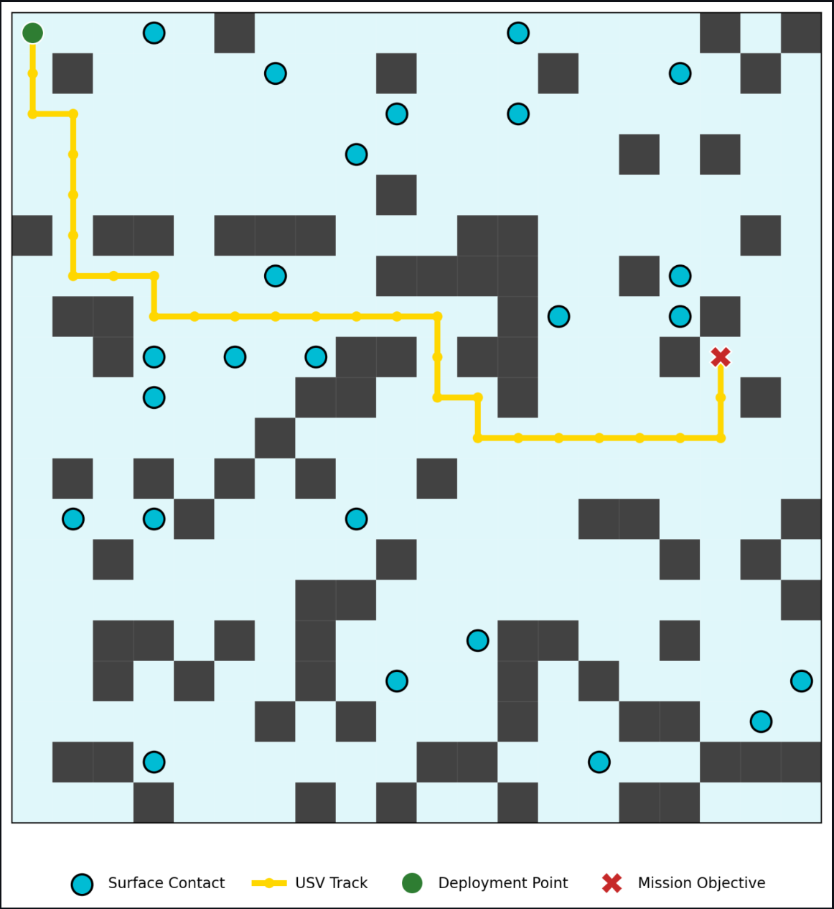

# USV Mission Planner


## Overview

**In autonomous maritime operations, path planning is critical for Unmanned Surface Vessels (USVs) to navigate contested waters while minimizing fuel consumption and avoiding static hazards.**

This project is a simulation and visualization tool for the **A* (A-Star) Pathfinding Algorithm**, a foundational component of autonomy stacks used to calculate optimal routes through a discretized navigation grid. It allows operators to simulate mission parameters, visualize exclusion zones, and determine the most fuel-efficient path for a USV in a cluttered maritime environment.



## Key Features

* **A* Pathfinding Algorithm**: Implements the A* search algorithm using the **Manhattan Distance** heuristic, optimized for grid-based maritime navigation where movement is restricted to cardinal directions (Up, Down, Left, Right).
* **Dynamic Environment Generation**:
    * **Landmasses (Static Hazards)**: Randomly generates exclusion zones to simulate islands, shoals, or restricted operating areas (Dark Grey).
    * **Surface Contacts (Dynamic Hazards)**: Simulates other vessels or floating hazards (Cyan markers) that must be avoided.
* **Mission Metrics**: Improves operational relevance by calculating and displaying **Fuel Cost** (total distance units) for the generated route.
* **Interactive Mission Planning**:
    * Set **Deployment Points** (Start) and **Mission Objectives** (End) via a clean sidebar interface.
    * Adjust the density of surface contacts to test the algorithm's performance in high-traffic scenarios.
* **Operational Visualization**:
    * **Blue**: Navigable Water
    * **Dark Grey**: Landmass / Exclusion Zones
    * **Cyan**: Surface Contacts
    * **Gold**: Optimal USV Track

## Installation & Usage

### Prerequisites
Ensure you have Python installed along with the following dependencies:

```bash
pip install streamlit numpy matplotlib
```

### Running the Application
1. Clone the repository to your local machine

```bash
git clone [https://github.com/your-username/usv-mission-planner.git](https://github.com/your-username/usv-mission-planner.git)
cd usv-mission-planner
```

2. Launch the Streamlit App

```bash
streamlit run app.py
```

3. Access the interface

The application will automatically open in your default web browser at http://localhost:8501

## Algorithm Logic

The core of this planner is the A (A-Star) Search Algorithm*, a best-first search algorithm widely used in autonomous vehicle navigation because of its efficiency and accuracy. It calculates the optimal path by minimizing the total cost function $f(n)$:
$$f(n) = g(n) + h(n)$$
$g(n)$ (Actual Cost): The distance from the Deployment Point (Start) to the current grid cell. In this grid, moving to an adjacent cell has a cost of 1 fuel unit.

$h(n)$ (Heuristic Cost): The estimated distance from the current cell to the Mission Objective (End).

### The Heuristic: Manhattan Distance

Because the USV in this simulation is restricted to 4-directional movement (North, South, East, West) and cannot move diagonally, we use the Manhattan Distance (Taxicab Geometry) as the heuristic. This ensures the algorithm is "admissible"—it never overestimates the cost of reaching the goal, guaranteeing the shortest path is found.

The formula used is:

$$h(n) = |current.x - goal.x| + |current.y - goal.y|$$

If Euclidean Distance (straight line) were used, the algorithm might underestimate the fuel cost, leading to inefficient pathing decisions in a grid-locked environment.

## Future Roadmap

We are actively working to expand the capabilities of this planner to better simulate complex maritime environments:

[ ] Diagonal Movement: Implement Chebyshev distance heuristics to allow 8-directional movement (including diagonals).

[ ] Dynamic Obstacles: Introduce moving surface contacts to simulate collision avoidance scenarios (COLREGS compliance).

[ ] Variable Sea States: Instead of binary (Pass/Fail) obstacles, implement "high cost" zones representing rough seas or strong currents that the USV can traverse but prefers to avoid to save fuel.

[ ] Map Integration: Overlay the grid onto real-world satellite imagery or NOAA nautical charts.

[ ] Waypoint Export: Add functionality to export the calculated path as a JSON or CSV list of coordinates for ingestion by real-world autopilot systems (e.g., MAVLink).

## Contributing

Contributions to improve the efficiency or realism of the simulation are welcome!

1. Fork the repository.

2. Create a new Feature Branch ```git checkout -b feature/AmazingFeature```

3. Commit your changes ```git commit -m 'Add some AmazingFeature'```

4. Push to the branch ```git push origin feature/AmazingFeature```

5. Open a Pull Request.

Please ensure any new algorithmic additions include comments explaining the heuristic changes.
